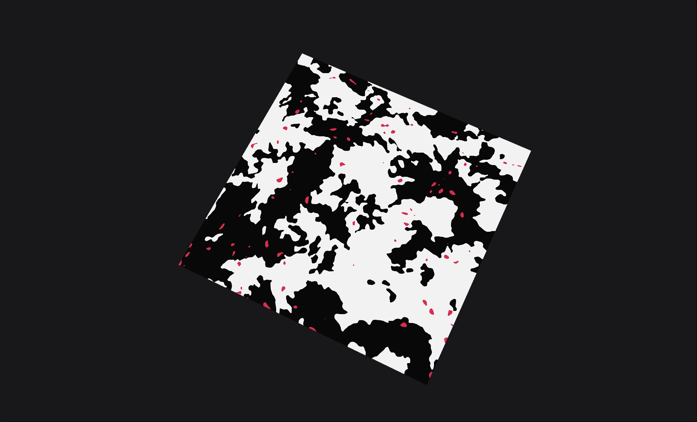

# BlobRemover

A low-level node that helps isolate and remove small blobs or disconnected shapes.

<figure><figcaption></figcaption></figure>

* **Range**: Sensitivity of the blob detection.
* **Connectivity**: How connected the blobs can be to larger shapes.
