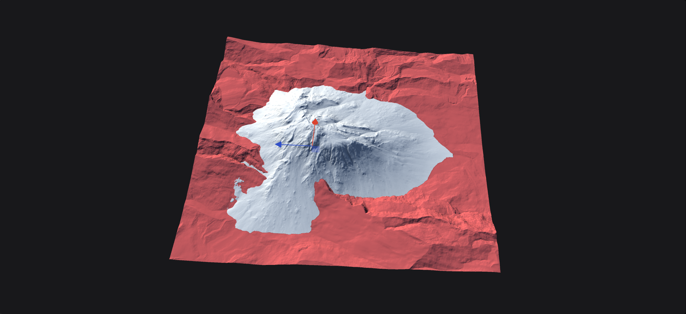

# Transform

Transform allows you to move, rotate, and scale any terrain. The Transform node can be implemented at any point in your graph as it is a post-process effect.

<figure><figcaption></figcaption></figure>


If your terrain has a hard edge, try using the `Zero Borders` node before applying the Transform node.


## Properties

### Position

* **Offset X/Y/Z**: Controls the position of the input on the surface.

### Scale

* **Uniform**: This applies uniform scale, when unchecked it applies the non-uniform scale.
* **Scale**: The uniform scale on both axes.
* **Scale X**: The non-uniform scale on the X axis.
* **Scale Y**: The non-uniform scale on the Y axis.

### Rotation

* **Angle**: The angle of rotation of the terrain.

### Settings

* Blend Mode: The [desired blend mode](../utility/combine.md#properties). Usually Add or Max are the recommend ways.
* Edges
  * **None:** Unmodified edge.
  * **Thin**: Thin edge fade.
  * **Wide**: Wide edge fade.
  * **Soft**: Very wide edge fade.
* Quality
  * **Draft**: Low quality, mostly used for design-time.
  * **Medium**: Medium quality, often good for production, but may still produce some artifacts.
  * **High**: Recommended quality for final production.
