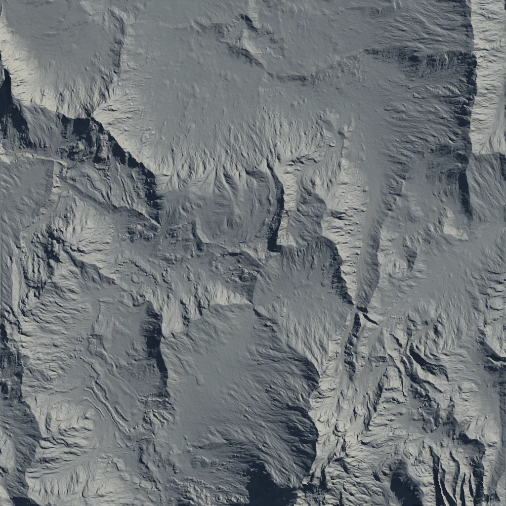
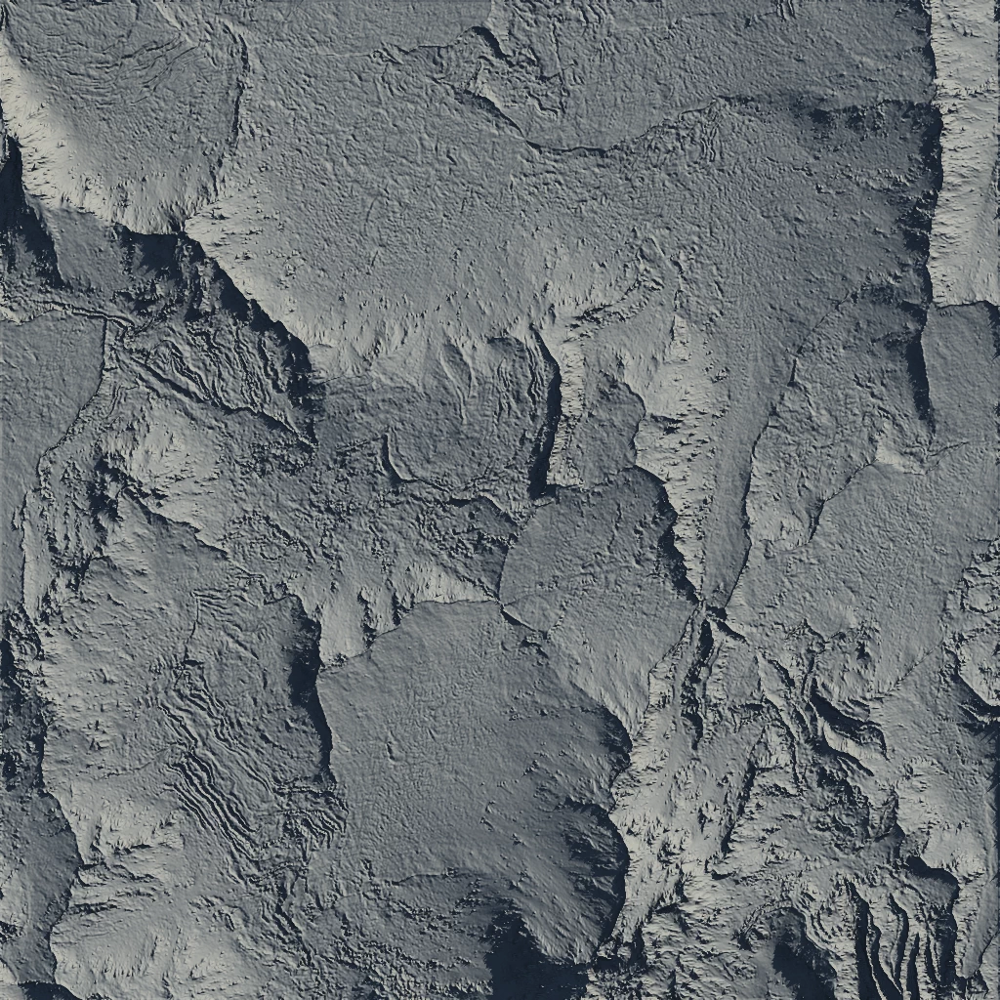
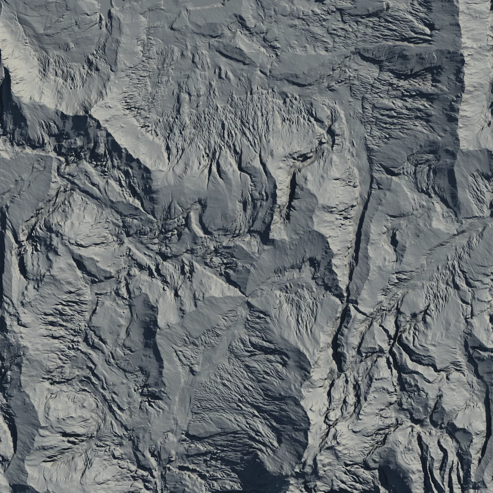

# Anastomosis

***

Anastomosis creates interconnected water flow based downcutting, ranging from small pits to large river channels. It can be used for roughening up a surface without losing the features of that terrain, and for deepening existing flow structures.

Before and after Anastomosis.

Using high Impact and Influence values in Destructive mode.

Using a high Impact value in Rivers mode.

## Properties

* **Impact**\
  The intensity of the process. Higher values create stronger physical impacts within the erosion process.
* **Width**\
  The impact's reach or width. Higher values create wider areas of impact.
* **Depth**\
  The depth of the flow's impact. Higher values create deeper grooves in the terrain.
* **Downcutting**\
  The downcutting level as decided by water flow. Higher values take longer to process but create wider flows with longer impact profiles.
*   **Quality**

    The quality of the flow simulation.
