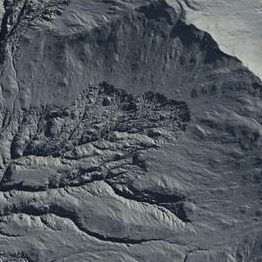

# Crumble

Crumble runs a different kind of simulation that feeds off of existing crevices, erosive information, and other subtle details to collapse the terrain. Just as the name implies, the terrain starts crumbling from the edges. It runs a different kind of simulation that feeds off of existing crevices, erosive information, and other subtle details to collapse the terrain. Just as the name implies, the terrain starts crumbling from the edges.

Crumble works with just about any Primitive, Erosion, and Surface node. While the controls may seem somewhat simplistic, they can create a wide range of effects depending on the combination.

### Controlling the Edge

Horizontal bias shifts the erosion either towards the beginning of flow structures or towards the deposits at the end. Vertical bias shifts the erosion towards the higher altitude or lower altitudes.

While both may look simple, combining them in unique ways can give you a variety of different-looking terrains.

While Crumble does "eat away" the edges, the control over the edges was limited. With the new Edge slider, you can reduce or expand the effect the erosion process has on sharp edges. You can combine this with the Rock Hardness slider for absolute control.

## Properties

* **Duration**\
  Controls how long the simulation runs. Longer duration produce stronger crumbling effects.
* **Strength**\
  Defines how intensely the rock or terrain breaks apart from the main body.
* **Coverage**\
  Sets how far the crumbling effect spreads inward from exposed edges.
* **Horizontal**\
  Biases the crumble effect towards flow origins or towards deposits.
* **Vertical**\
  Biases the crumble effect towards higher or lower altitudes.
* **Rock Hardness**\
  Controls material resistance, reducing how much terrain collapses.
* **Edge**\
  Expands or reduces the impact of crumbling specifically on sharp terrain edges.
* **Downcutting**\
  Controls how deeply the simulation carves downward into the terrain during crumbling.
* **Depth**\
  Adjusts the overall depth of the collapsed areas.
