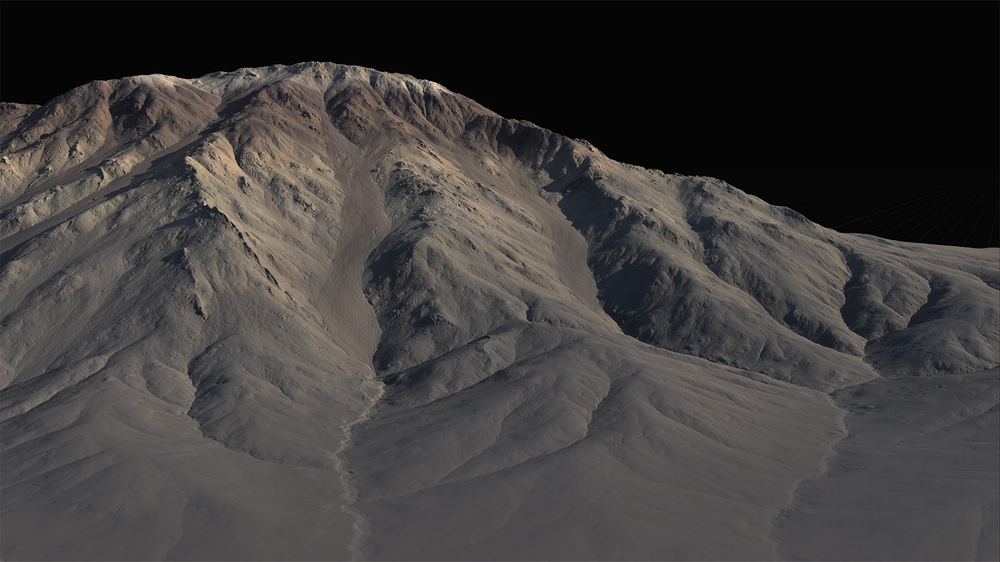

# Erosion2

The **Erosion\_2** node in Gaea 2 is a powerful new erosion algorithm designed to enhance terrain shaping capabilities beyond the traditional [Classic Erosion](erosion.md).

Despite its complexity, Erosion\_2 remains user-friendly and delivers deterministic results with up to 10x faster performance, even on the CPU.

It simulates advanced hydraulic erosion with realistic sediment transport and terrain reshaping. It offers fine control over downcutting, sediment deposition, and orographic (rainfall-driven) effects for highly detailed or stylized terrains.

<figure><figcaption></figcaption></figure>

## Properties

### General

* **Duration**\
  Controls how long erosion runs. Longer durations produce more elaborate terrain reshaping, while shorter durations help preserve original forms.
* **Downcutting**\
  Governs how deeply water cuts into the terrain, carving valleys and channels.
* **Erosion Scale**\
  Sets the overall size of erosion features, from fine gullies to massive ravines.
* **Seed**\
  Randomizes the erosion pattern while keeping other settings the same.

### Sediment Discharge

Defines how different sediment types are transported and deposited during erosion.

* **Suspended Load**\
  Fine, light sediments that travel far and fill gullies with subtle detail.
* **Suspended Angle**\
  Sets the slope at which suspended load settles.
* **Bed Load**\
  Heavier sediments like gravel that fill and shape gullies and slopes.
* **Bed Angle**\
  Sets the slope angle for bed load deposition.
* **Coarse Sediments**\
  The heaviest materials (boulders, scree) that deposit on steep slopes.
* **Coarse Angle**\
  Controls the slope threshold for coarse sediment settling.

### Shape

Enables artistic control over how erosion reshapes terrain.

* **Shape**\
  Balances between preserving the original shape and allowing natural reshaping.
* **Shape Sharpness**\
  Defines how sharp or concave ridges become after erosion.
* **Shape Detail Scale**\
  Sets the scale of simulated details, from broad ravines to fine gullies.

### Orographic Influence

Controls how rainfall-driven erosion is applied across terrain features.

* **Enable**\
  Toggles orographic influence on or off.
* **Directional Precipitation**\
  Simulates rain falling more intensely from one direction to create rain shadows.
* **Direction**\
  Sets the direction from which rainfall comes most strongly.
* **Rain Shadow**\
  Controls how strongly terrain blocks rainfall from certain directions.
* **Altitude and Slope**\
  Limits rainfall effects to specific elevation and slope ranges for precise targeting.
* **Reverse**\
  Inverts the influence mask for creative control.

