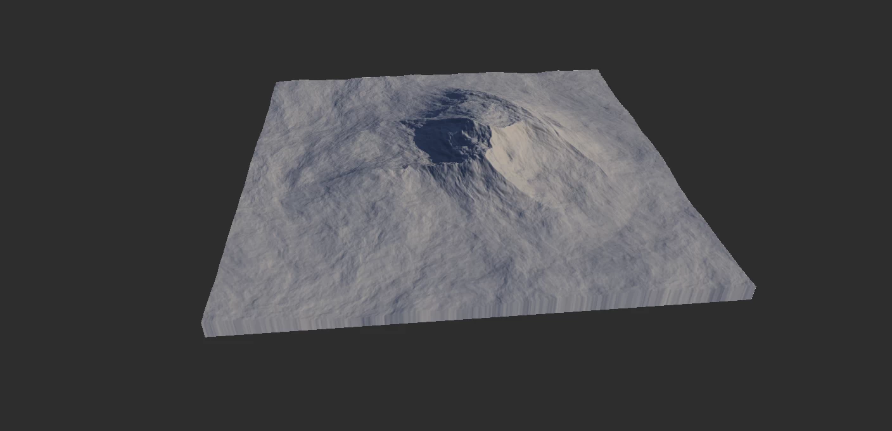
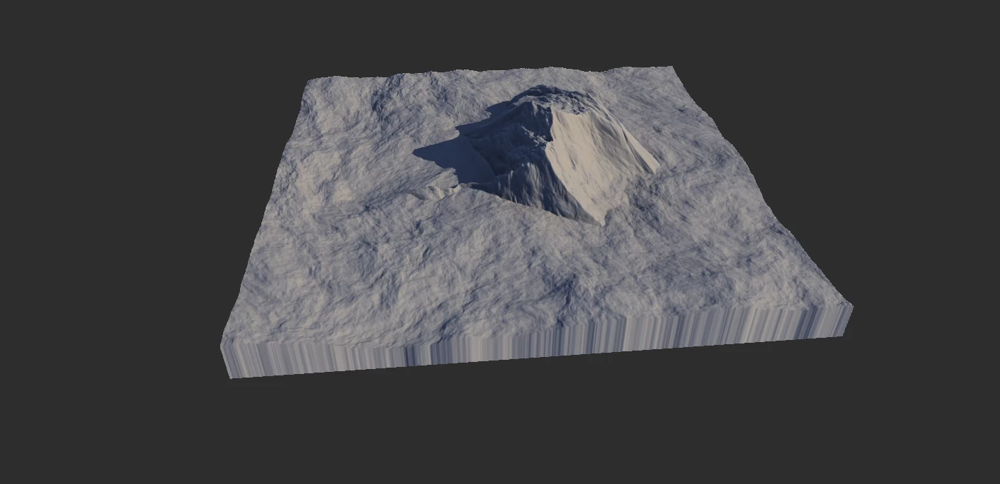
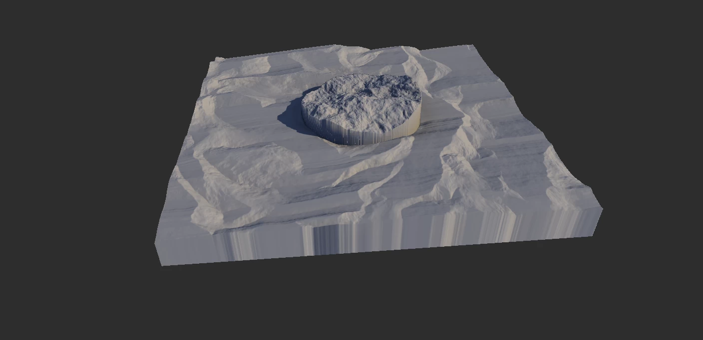

# Combine

The Combine node is one of the most important nodes in Gaea. It allows you to take two outputs (terrains, masks, or color maps) and combine them using various mathematical operations, often known as 'Blend Modes'.

In addition, the Combine node also gives you a separation mask for texturing purposes when working with terrains and masks.

### Using Combine

**Color Mixing**

With Gaea 1.2, Combine has replaced the Mixer node. Combine can now handle color map blending to give you additional flexibility.

Combine will switch to color blending mode when the first input is a color map. The second should be a color map too. If the second input is a mask or heightfield it will be converted into an RGB color map.

Inversely, if the first input is a heightmap or mask and the second is a color map, the second map will be converted into a grayscale mask.

**Example**

This is an example of equally blending (Mode: Blend, Ratio: 50%) Perlin and Mountain nodes. 

If you switch the mode to Max and Ratio to 100%: 

If you plug in a shape of any kind to the Mask input of the Combine node, the brighter parts of the mask will be replaced with the first input, while darker areas will be replaced with the second input. If your mask is soft (ie - lots of grays instead of just black and white) then the blending between the two will be soft. This is usually the preferred method. 

### Additional Scenarios

**Clamped Output**

By default, Combine will clamp the output between `0..1`. This is a safety precaution for mixing masks and other values where the value scale is not readily apparent and can cause issues in other nodes.

If you're adding two terrains where the combined output goes beyond `1.0`, it will return flat portions in such areas. To prevent this, you can turn off `Clamp Output`. However, to properly use this data you must bring it within the "acceptable range". To do this, you should enable `Autolevel (Lv)` in the [Modifier Stack](https://app.gitbook.com/s/-MRH8eXs83d5sUGKdsHp/getting-started/user-interface/property-editor/modifier-stack "mention") and then `Clamp`. This will bring the whole mask or terrain within the safe range.

Alternatively, you can add an Fx node to the Combine output or other nodes like Clamp and bring it down manually.

<table><thead><tr><th width="162.4000244140625">Mode</th><th>Description</th><th>Process Detail</th></tr></thead><tbody><tr><td><strong>Blend</strong></td><td>Simply overlays the source on top of the base without extra math.</td><td>Direct normal blend; top layer replaces base with alpha control.</td></tr><tr><td><strong>Add</strong></td><td>Brightens by adding the source to the base.</td><td>Linear addition of source and base channels, clamped at max.</td></tr><tr><td><strong>Screen</strong></td><td>Lightens by blending as if projected on a screen.</td><td>Inverts both, multiplies, then inverts; 1 - (1 - A) × (1 - B).</td></tr><tr><td><strong>Subtract</strong></td><td>Darkens by subtracting the source from the base.</td><td>Base minus source per channel, clamps at zero.</td></tr><tr><td><strong>Difference</strong></td><td>Emphasizes contrast by subtracting lower from higher values.</td><td>Absolute difference |A - B| for high-contrast edge-like results.</td></tr><tr><td><strong>Multiply</strong></td><td>Darkens by multiplying source and base colors.</td><td>Channel-wise multiplication; A × B, darkens with stacking.</td></tr><tr><td><strong>Divide</strong></td><td>Lightens by dividing base by source.</td><td>Base divided by source; A / B with normalization/scaling.</td></tr><tr><td><strong>Divide2</strong></td><td>Alternative division with different scaling for smoother results.</td><td>Alternate divide with different scaling/offset to reduce clipping.</td></tr><tr><td><strong>Max</strong></td><td>Keeps the brighter value at each pixel.</td><td>Channel-wise maximum; keeps highest of A and B.</td></tr><tr><td><strong>Min</strong></td><td>Keeps the darker value at each pixel.</td><td>Channel-wise minimum; keeps lowest of A and B.</td></tr><tr><td><strong>Hypotenuse</strong></td><td>Combines channels using geometric distance for soft blending.</td><td>sqrt(A² + B²); Euclidean combination for smooth, bright blend.</td></tr><tr><td><strong>Overlay</strong></td><td>Combines multiply and screen for vivid contrast.</td><td>Combines Multiply and Screen based on base brightness.</td></tr><tr><td><strong>Power</strong></td><td>Raises base to the power of source for nonlinear effects.</td><td>Raises base to source power; A ^ B per channel.</td></tr><tr><td><strong>Exclusion</strong></td><td>Low-contrast version of Difference for softer inversion.</td><td>A + B - 2AB; softer Difference with reduced contrast.</td></tr><tr><td><strong>Dodge</strong></td><td>Brightens highlights by dividing inverted base by inverted source.</td><td>A / (1 - B); brightens highlights aggressively.</td></tr><tr><td><strong>Burn</strong></td><td>Darkens shadows by inverting, dividing, and inverting again.</td><td>1 - (1 - A) / B; intensifies shadows via division.</td></tr><tr><td><strong>SoftLight</strong></td><td>Gently lightens or darkens based on source brightness.</td><td>Conditional blend approximating diffused light on surface.</td></tr><tr><td><strong>HardLight</strong></td><td>Strong contrast blend combining multiply and screen.</td><td>Screen or Multiply based on source brightness threshold.</td></tr><tr><td><strong>PinLight</strong></td><td>Replaces pixels selectively with lighter or darker values.</td><td>Replaces mid-range with source; keeps extremes from base.</td></tr><tr><td><strong>GrainMerge</strong></td><td>Adds source to base with mid-gray treated as transparent.</td><td>A + B - 0.5; mid-gray = no change; good for texture merge.</td></tr><tr><td><strong>GrainExtract</strong></td><td>Subtracts source from base, centering results on mid-gray.</td><td>A - B + 0.5; isolates texture/detail difference.</td></tr><tr><td><strong>Reflect</strong></td><td>Creates intense highlights by reflecting colors around white.</td><td>A² / (1 - B); creates sharp highlight “reflection” effects.</td></tr><tr><td><strong>Glow</strong></td><td>Emphasizes bright regions for a glowing effect.</td><td>Inverse Dodge-like; emphasizes light bloom by brightening source areas.</td></tr><tr><td><strong>Phoenix</strong></td><td>Produces a fiery inversion by subtracting and swapping values.</td><td>A - B + max(A, B); surreal color inversions with swap-like logic.</td></tr></tbody></table>

## Properties

* **Ratio**  
  The ratio applied to the selected method.
* **Mode:** The blend mode to use to combine the two inputs.
* Output
  * **None:** Unclamped output. Be careful!
  * **Clamp:** Clamp output to 0..1 range. (Default)
  * **Extend:** Use when lowest values go beyond 0.5.
* Enhance Input
  * **None**  
  Unchanged output.
  * **Autolevel**  
  Autolevel the inputs before merging.
  * **Equalize**  
  Equalize the inputs before merging.
* **Swap Inputs**  
  Switches the two inputs.



