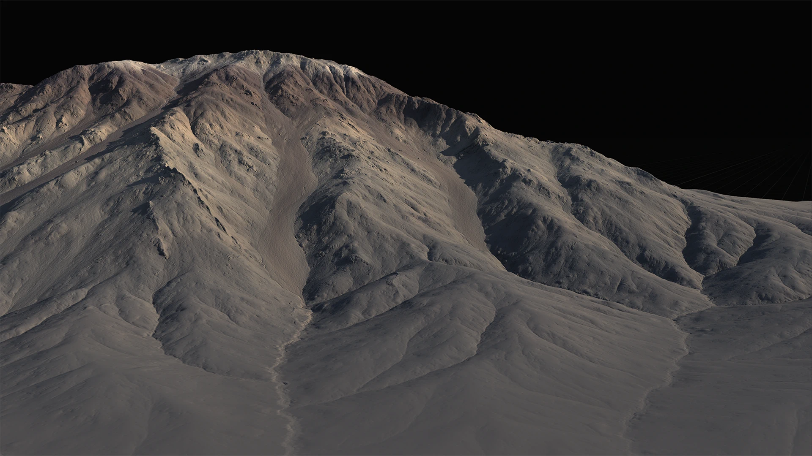
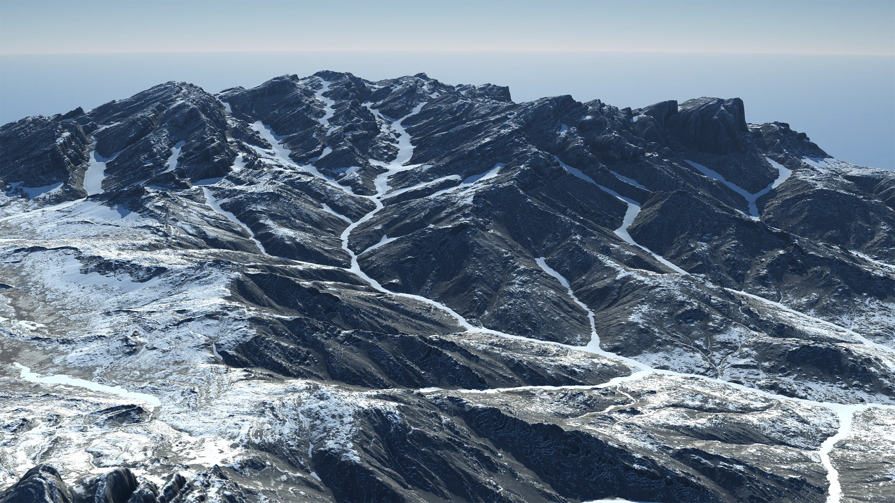

# Erosion2

Gaea 2 introduces a new erosion algorithm designed to work alongside the existing Classic Erosion, offering enhanced capabilities for terrain shaping.

<figure><figcaption></figcaption></figure>

**New Features and Enhancements:**

* **Expanded Erosion Options:** The new algorithm introduces additional parameters, allowing for more precise control over terrain erosion.
* **New Terrain Shapes:** Erosion\_2 enables the creation of terrain features that were not possible with the previous algorithm.
* **Terrain Character Preservation:** The new algorithm better preserves the underlying characteristics of the original terrain during the erosion process.
* **Side-by-Side Operation:** Erosion\_2 is fully compatible with Classic Erosion, allowing users to choose between or combine both algorithms for different results.
* **Ease of Use:** The controls for Erosion\_2 have been simplified, making it easier to achieve desired outcomes.
* **Deterministic Results:** Erosion\_2 maintains consistent, deterministic results without any loss in performance.

Erosion\_2 also offers significant performance improvements, with speed boosts of up to 10x compared to Erosion\_1, even when running on the CPU. his new algorithm strikes a balance between generating realistic erosion effects and allowing for artistic flexibility, making it possible to create terrain shapes that were previously challenging or impractical with Classic Erosion.

## Using Erosion 2

<figure><figcaption></figcaption></figure>

These parameters offer extensive control over the erosion process, enabling users to tailor the effects to meet specific terrain requirements, whether for realistic or artistic purposes.

## Properties

<table><thead><tr><th width="206">Property</th><th>Description</th></tr></thead><tbody><tr><td><strong>General</strong></td><td></td></tr><tr><td>Duration</td><td>Controls the length of time over which the erosion process occurs. Higher values result in more extensive erosion, simulating longer periods of natural erosion.</td></tr><tr><td>Downcutting</td><td>Adjusts the degree to which the erosion cuts down into the terrain. Increasing this value deepens valleys and channels, simulating stronger erosion forces.</td></tr><tr><td>Erosion Scale</td><td>Determines the size of the erosion features in meters. Adjusting this value affects the scale of the erosion patterns, allowing for either broader or finer details depending on the needs of the terrain.</td></tr><tr><td>Seed</td><td>Sets the random seed for the erosion process, allowing for repeatable results. Changing the seed will produce different variations of the erosion pattern.</td></tr><tr><td><strong>Sediment Discharge</strong></td><td></td></tr><tr><td>Suspended Load</td><td>Determines the amount of sediment that is carried away by the water flow. Higher values increase the transportation of fine materials, leading to smoother terrain features.</td></tr><tr><td>Suspended Angle</td><td>Controls the angle at which sediment is suspended and deposited. A higher angle means steeper terrain can support sediment before it is deposited.</td></tr><tr><td>Bed Load</td><td>Adjusts the amount of sediment that is pushed along the ground, contributing to the buildup of new terrain features like ridges and terraces.</td></tr><tr><td>Bed Angle</td><td>Sets the angle threshold for sediment to be deposited as bed load. A higher angle allows for sediment to be pushed along steeper slopes before settling.</td></tr><tr><td>Coarse Sediments</td><td>Controls the amount of larger, heavier particles that are moved by the erosion process. These particles contribute to the formation of rougher, more rugged terrain features.</td></tr><tr><td>Coarse Angle</td><td>Determines the angle at which coarse sediments settle. Higher values allow these larger particles to be carried over steeper slopes before being deposited.</td></tr><tr><td><strong>Shape</strong></td><td></td></tr><tr><td>Shape</td><td>Modifies the overall structure of the erosion patterns, influencing how the erosion shapes the terrain. A higher value results in more pronounced terrain alterations.</td></tr><tr><td>Shape Sharpness</td><td>Controls the sharpness of the erosion features. Increasing this value makes the edges of the eroded features more defined and jagged.</td></tr><tr><td>Shape Detail Scale</td><td>Adjusts the level of detail in the erosion patterns. Higher values introduce finer details into the terrain, creating more intricate erosion effects with the small risk of creating sharp, spikes and other such details.</td></tr></tbody></table>

#
